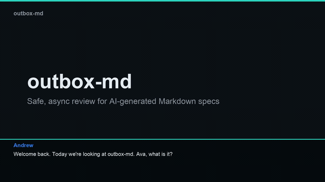

# outbox-md

> Local-first, agent-agnostic review for AI-generated Markdown specs.

<!-- Replace the YouTube links below with the uploaded video URLs. -->
<div align="center">

[](https://youtu.be/REPLACE_WITH_EXPLAINER_VIDEO_ID)

**▶ [What is outbox-md?](https://youtu.be/REPLACE_WITH_EXPLAINER_VIDEO_ID)** &nbsp;·&nbsp; **▶ [Using outbox-md (tutorial)](https://youtu.be/REPLACE_WITH_TUTORIAL_VIDEO_ID)**

</div>

**Status:** pre-alpha — walking skeleton.

Read and inline-annotate AI-generated Markdown. Your comments never edit the document directly — they enter an ordered **outbox** and are processed asynchronously by any AI agent connected over MCP. The agent proposes a tracked change or replies in a thread; you accept, and the file is rewritten and versioned. The document is never corrupted.

- **Local-first** — runs in one Docker container pointed at a folder of `.md` files.
- **Bring-your-own-agent** — ships **no LLM credentials** and embeds no model. Any agent connects via MCP.
- **Zero secrets** — nothing leaves your machine.

## Quickstart (walking skeleton)

```bash
docker build -t outbox-md:dev .
mkdir -p sample && printf "# Spec\n\nHello world\n" > sample/spec.md
docker run --rm -p 8080:8080 -e OUTBOX_DEV=1 -v "$PWD/sample:/data" outbox-md:dev
# open http://localhost:8080
```

Agents connect over MCP at `http://localhost:8080/mcp` (Streamable HTTP). With `OUTBOX_DEV=1`, the agent loop can also be driven over HTTP for testing (`/api/dev/claim`, `/api/dev/propose`).

## Watch & learn

| Explainer — *"What is outbox-md?"* | Tutorial — *"Using outbox-md"* |
|:---:|:---:|
| [](https://youtu.be/REPLACE_WITH_EXPLAINER_VIDEO_ID) | [](https://youtu.be/REPLACE_WITH_TUTORIAL_VIDEO_ID) |
| The problem, the outbox model, and how to contribute | Run it → comment → connect an agent → accept |

The videos are a podcast-style Q&A between **Andrew** and **Ava**, rendered from committed scripts and slides:

```bash
python3 scripts/build_video.py docs/media/explainer.script.json docs/media/out/explainer
python3 scripts/build_video.py docs/media/tutorial.script.json  docs/media/out/tutorial
```

Narration uses [edge-tts](https://github.com/rany2/edge-tts) (Andrew/Ava neural voices, no API key); slides are rendered with Pillow; assembly is ffmpeg. Edit the `*.script.json` files and re-run to update. The MP4s live on YouTube; only the scripts, slides, thumbnails, and hero GIF are committed.

## Design

See the full design spec: [`docs/specs/2026-06-27-outbox-md-design.md`](docs/specs/2026-06-27-outbox-md-design.md).
Implementation plan: [`docs/plans/2026-06-27-phase0-and-v1-core.md`](docs/plans/2026-06-27-phase0-and-v1-core.md).

## License

MIT — see [LICENSE](LICENSE).
