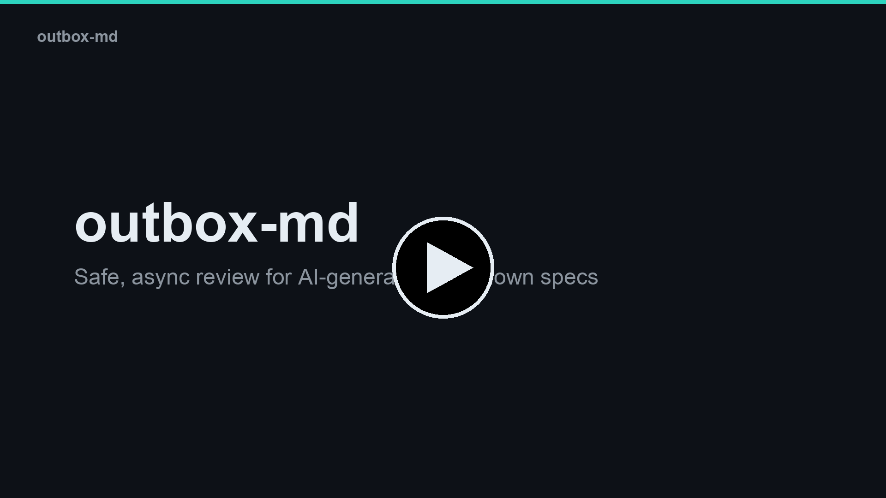
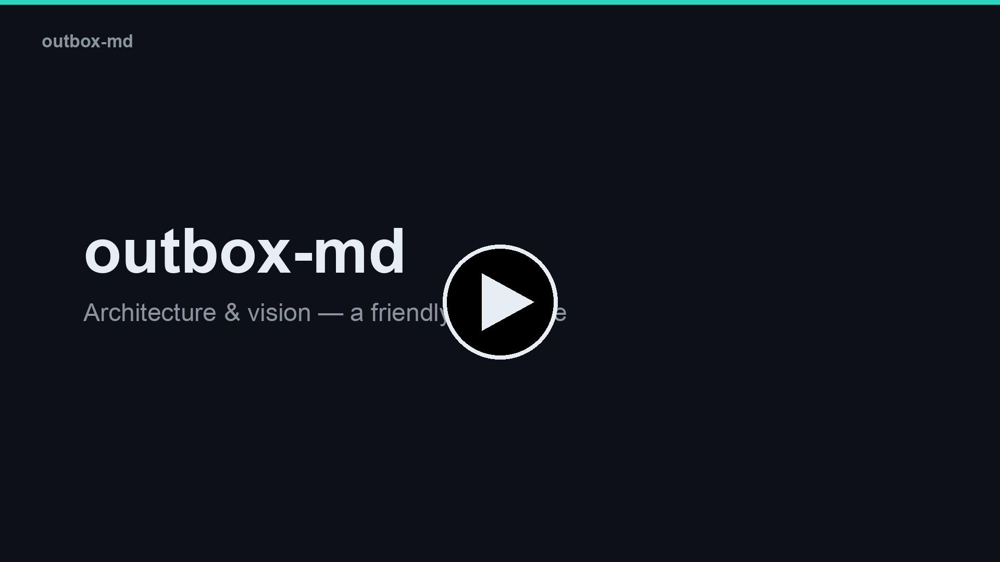

# outbox-md

> Local-first, agent-agnostic review for AI-generated Markdown specs.

<div align="center">

<a href="https://www.youtube.com/watch?v=CNT49m0xBOY">
  
</a>

<em>▶ <b><a href="https://www.youtube.com/watch?v=CNT49m0xBOY">What is outbox-md?</a></b> — the 2-minute intro</em>

</div>

Read and inline-annotate AI-generated Markdown in your browser. Your comments **never edit the document directly** — they enter an ordered **outbox** and are handled by *any* AI agent you connect over **MCP**. The agent proposes a tracked change or replies; you accept; the file is rewritten and versioned. **The document is never corrupted.**

- **Local-first** — points at a folder of `.md` files on your machine. Nothing leaves it.
- **Bring-your-own-agent** — ships **no LLM credentials**. Connect Claude, GPT, or anything that speaks MCP.
- **Safe by construction** — feedback is ordered, edits are tracked changes you approve, the on-disk file is never silently changed.

---

## Quickstart

**1. Install** (macOS + Linux):

```bash
curl -fsSL https://raw.githubusercontent.com/rajanrx/outbox-md/main/install.sh | sh
```

**2. Point it at a folder of `.md` specs and start:**

```bash
cd path/to/your/specs
outbox init      # scaffold outbox.yaml + register the MCP with Claude Code (if installed)
outbox up        # serve the review UI and open it in your browser
```

**3. Connect your agent** — if `init` didn't do it automatically, add this MCP endpoint to your AI client (one URL, no API key):

```
http://localhost:8181/mcp
```

**4. Review** — select a sentence, leave a comment. Your agent picks it up, proposes a tracked change, and you **Accept** — the `.md` is rewritten and versioned. That's the loop.

> ### 📖 [Setup & Usage Guide →](SETUP.md)
> Docker · **multiple projects** · other agents (Cursor / Claude Desktop / …) · `sources` scoping · hands-off automation & runners · all commands. Everything beyond the quickstart lives there.

---

## How it works

You comment on a doc; the comment enters an **ordered outbox** instead of touching the file. The server notifies your agent (over MCP) and updates your browser live. The agent **claims** a comment and either **proposes a tracked change** or **replies**; you **accept**, and only then is the `.md` rewritten and a new version recorded. Resolving comments and approving docs stay **human-only** — an agent can't accept its own work.

```
   you (browser)                              your AI agent
  ┌──────────────────┐                   ┌──────────────────────┐
  │ comment / accept │──▶ ordered outbox │ claim → propose /    │
  │ reply / resolve  │◀── live (SSE) ────│ reply  (via MCP)     │
  └──────────────────┘                   └──────────────────────┘
                   accept → file rewritten + versioned
```

---

## Status & limitations

The review loop, governance, and audit log all work and are covered by tests. Honest caveats:

- **Local-first & unauthenticated** — built for a single user on `localhost`. **Don't expose the port** without auth in front (see [`SECURITY.md`](SECURITY.md)).
- **Supervise long agent runs** — a crashed agent's claims aren't auto-recovered yet (no reaper).
- **Agents respond, they don't initiate** — an agent acts on comments *you* raise; it can't open new ones (AI-council is on the roadmap).

---

## Watch & learn

<div align="center">
<table>
<tr>
<td width="50%" valign="top">
  <a href="https://www.youtube.com/watch?v=4VH7NT095ms"></a>
  <p align="center"><b>▶ <a href="https://www.youtube.com/watch?v=4VH7NT095ms">Using outbox-md</a></b><br/>Run it → comment → connect an agent → accept</p>
</td>
<td width="50%" valign="top">
  <a href="https://www.youtube.com/watch?v=VmuwLniMU9M"></a>
  <p align="center"><b>▶ <a href="https://www.youtube.com/watch?v=VmuwLniMU9M">Architecture &amp; Vision</a></b><br/>The hard parts and where it's headed — for builders</p>
</td>
</tr>
</table>
</div>

## Design

- Core design: [`docs/specs/2026-06-27-outbox-md-design.md`](docs/specs/2026-06-27-outbox-md-design.md)
- Governance seam: [`docs/specs/2026-06-28-governance-seam-design.md`](docs/specs/2026-06-28-governance-seam-design.md)
- Decision log: [`docs/specs/2026-06-30-decision-log-design.md`](docs/specs/2026-06-30-decision-log-design.md)

## License

MIT — see [LICENSE](LICENSE). Contributions welcome — see [`CONTRIBUTING.md`](CONTRIBUTING.md).
