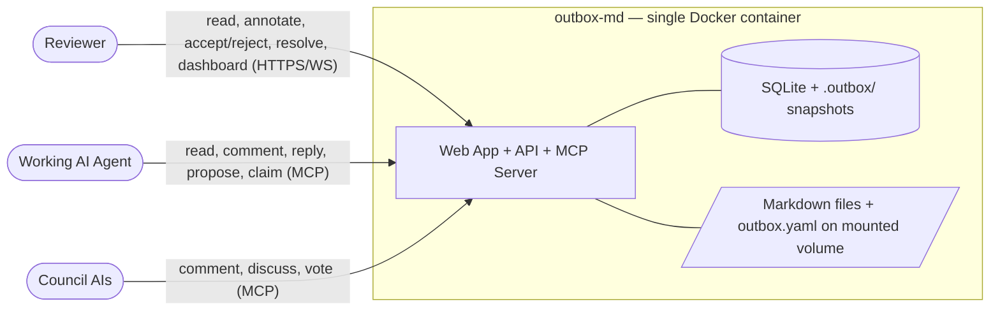
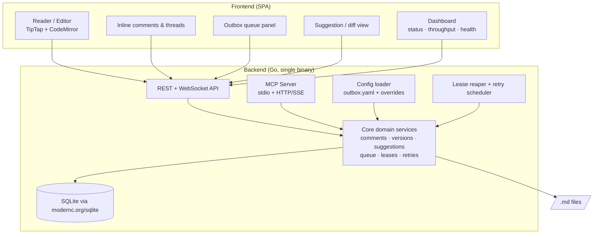
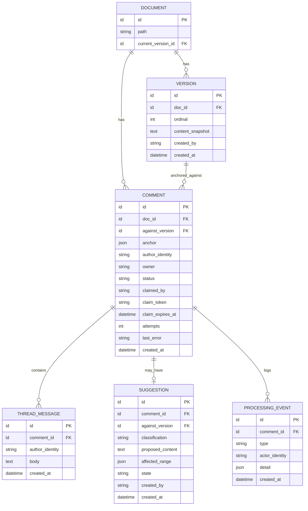

# outbox-md — Design Specification

| | |
|---|---|
| **Document** | Design Specification |
| **Project** | outbox-md |
| **Status** | Draft — pending approval |
| **Version** | 0.4 |
| **Date** | 2026-06-27 |
| **Type** | Greenfield · Open-source · Local-first |
| **Repository** | https://github.com/rajanrx/outbox-md (public) |
| **Go module** | `github.com/rajanrx/outbox-md` |
| **License** | MIT |
| **Authors** | Project team |

---

## Table of contents

1. [Executive summary](#1-executive-summary)
2. [Problem statement](#2-problem-statement)
3. [Goals & non-goals](#3-goals--non-goals)
4. [Guiding principles](#4-guiding-principles)
5. [Domain model](#5-domain-model)
6. [Configuration](#6-configuration)
7. [System architecture](#7-system-architecture)
8. [Technology stack](#8-technology-stack)
9. [Data model](#9-data-model)
10. [MCP interface](#10-mcp-interface)
11. [Versioning & merge strategy](#11-versioning--merge-strategy)
12. [Reliability & failure handling](#12-reliability--failure-handling)
13. [Observability & dashboard](#13-observability--dashboard)
14. [Key workflows](#14-key-workflows)
15. [Extensibility](#15-extensibility)
16. [Roadmap & deferred scope](#16-roadmap--deferred-scope)
17. [Risks & open questions](#17-risks--open-questions)

---

## 1. Executive summary

**outbox-md** is a local-first, Dockerized web application for **reading and inline-annotating AI-generated Markdown specifications**. A reviewer's comments are not applied to the document directly; they enter an ordered **outbox** and are processed **asynchronously** by any AI agent connected over the **Model Context Protocol (MCP)**. The agent either proposes a tracked-change suggestion or replies in a discussion thread. The document is therefore improved continuously while remaining **uncorruptible, ordered, and fully auditable**.

Processing is **durable and recoverable** — no posted feedback is ever lost, and failures are retried and then surfaced rather than dropped. Behaviour is governed by **enforced configuration**, and outbox health is visible through a **first-class dashboard**.

The application is deliberately **agent-agnostic**: it ships **no LLM credentials** and embeds no model. It is a *substrate* that exposes documents, comments, threads, suggestions, and version history over MCP, allowing Claude, GPT, Cursor, or any future agent to perform the reasoning.

## 2. Problem statement

AI agents (e.g. superpowers, Claude, GPT) routinely generate large Markdown specifications. The feedback loop on these artifacts is broken:

- Documents are read in a chat window or a generic editor with poor reading ergonomics.
- The only feedback channel is a disconnected chat message ("change section 3") — feedback is **detached from the text it refers to**.
- Applying feedback by re-prompting risks the agent **rewriting unrelated parts**, with no ordering guarantees and no audit trail.

There is currently **no purpose-built surface** for annotating an AI-generated document and iterating it safely into a finished specification.

## 3. Goals & non-goals

### Goals

- **G1** — A first-class reading and **inline-annotation** experience for Markdown.
- **G2** — Feedback is processed **asynchronously and in strict order**; the document is never mutated directly.
- **G3** — **Agent-agnostic** integration through MCP; no vendor lock-in, no embedded model.
- **G4** — Complete **auditability**: every version, comment, and decision is recorded.
- **G5** — **Zero-friction local deployment**: a single Docker container pointed at a folder.
- **G6** — **Durable & recoverable**: no posted feedback is ever lost; processing failures are retried with backoff and then surfaced, never silently dropped.
- **G7** — **Configurable & observable**: behaviour (batch size, council, extensions) is governed by enforced configuration; outbox health is visible through a built-in dashboard.

### Non-goals (v1)

- **NG1** — Embedding an LLM or shipping provider credentials.
- **NG2** — Using git as the versioning engine, or interacting with the host project's git.
- **NG3** — Real-time multi-user collaborative editing (CRDT).
- **NG4** — Multi-tenancy or hosted SaaS.
- **NG5** — Orchestrated multi-model council voting (the data model supports it; orchestration is deferred — see §16).

## 4. Guiding principles

- **North star — Safe async iteration.** When requirements conflict, prefer the option that (a) cannot corrupt the document and (b) preserves ordering and auditability. Performance and feature breadth yield to this.
- **Substrate, not orchestrator.** The app stores and exposes state; agents do the thinking.
- **The substrate is authoritative.** Configuration, ordering, leasing, and resolution rules are enforced by the backend — never trusted to the agent. A misbehaving agent cannot bypass them.
- **Nothing is lost.** Every comment is durable from post to terminal state; failures stay in the outbox until retried or explicitly parked.
- **One primitive for all authors.** Humans, the working agent, and council AIs all act through the same comment/thread model.
- **Resolution stays with the owner.** Only the author of a comment may resolve it (§5).
- **Build the seams, defer the features.** Extension points (multi-author identity, MCP boundary, edit classification, config namespaces) ship in v1; the features behind them (council orchestration, built-in processor) come later.

## 5. Domain model

| Concept | Definition |
|---|---|
| **Document** | A Markdown file under management. The on-disk `.md` is the *current projection* only. |
| **Version** | An immutable, linearly-ordered snapshot of a document's full content. |
| **Comment** | Feedback anchored to a text range, owned by its author, living in a thread. |
| **Thread** | The discussion attached to a comment: replies from any author (human / working agent / council). |
| **Suggestion** | A proposed tracked-change edit attached to a comment, classified `mechanical` or `substantive`. |
| **Outbox** | The ordered, durable queue of open comments awaiting agent processing. |
| **Claim (lease)** | A time-bounded hold an agent takes on one or more comments while processing; expires automatically if not completed in time. |
| **Processing event** | An append-only audit record of every state transition (claim, propose, accept, reject, fail, park, resolve…). Powers both the audit trail (G4) and the dashboard (§13). |
| **Author identity** | A first-class field on comments, replies, and suggestions: `human`, `agent`, or `council:<id>`. |

**Comment status lifecycle**

```
open ──claim──▶ claimed ──process──▶ addressed | replied ──owner──▶ resolved | closed
  ▲                │
  └── lease expiry / transient failure (attempts++) ──┘
                   │
                   └── attempts ≥ max_attempts ──▶ parked (needs attention)
```

**Rules**

- **Edit classes.** `substantive` edits always arrive as **suggestions** (accept/reject). `mechanical` edits (spelling, grammar, formatting) may **auto-apply**, gated by a config toggle that is **off by default**. The agent self-classifies each edit.
- **Resolution authority.** Only the original comment **owner** may resolve a comment. An agent may mark a comment *addressed* and attach a suggestion, but cannot close it.
- **Council as participants.** AIs other than the working agent post comments and discuss/vote **in the same threads**. "Voting" is a visible, multi-party thread surfaced to the human for context — not a separate subsystem.

## 6. Configuration

Configuration is **loaded and enforced by the backend** — the substrate is authoritative (§4). The agent receives the *effective* config read-only and the server caps what it can do (e.g. it cannot claim more than the configured batch size). Configuration cannot be bypassed by an agent.

**Two deliberately separate locations:**

| Path | Nature |
|---|---|
| **`outbox.yaml`** (folder root) | User-authored, committed, shareable. This is the configuration. |
| **`.outbox/`** | Generated state (SQLite, snapshots). Gitignored. Never hand-edited. |

**Layered precedence** (each layer overrides the previous):

```
built-in defaults  →  outbox.yaml (project)  →  per-document front-matter  →  live UI toggle (session)
```

Per-document overrides live in the document's Markdown **front-matter**, so they travel next to the doc.

**Example `outbox.yaml`:**

```yaml
processing:
  batch_size: 5             # max comments an agent may claim/read per cycle
  ordering: strict          # applies stay serialized regardless of batch size
  mechanical_auto_apply: false
  claim_lease_seconds: 300  # lease before a claimed comment returns to open
  max_attempts: 3           # retries before a comment is parked
  retry_backoff: exponential # none | fixed | exponential

council:
  enabled: false
  members: []               # agent identities allowed to act as council
  voting:
    mode: advisory          # advisory | quorum
    quorum: 2

observability:
  dashboard: true

extensions:
  <name>:
    enabled: false
    # extension-specific keys live in their own namespace
```

**Extension seam.** Every feature/extension owns a **namespaced section** (under `extensions:` or a reserved top-level key like `council:`) with its own schema and defaults. Unknown sections are ignored with a warning. Adding a capability means registering a config namespace; council is simply the first such module.

## 7. System architecture

### 7.1 System context



### 7.2 Component view



The backend is a **single Go binary** exposing two faces over the same core domain services: an **HTTP/WebSocket API** for the human UI (including the dashboard), and an **MCP server** for agents. Neither face mutates documents except through the core services, which enforce ordering, classification, leasing, configuration, and resolution rules. A background **reaper** returns expired claims to the queue and schedules retries.

### 7.3 Processing loop

```mermaid
sequenceDiagram
    participant H as Reviewer (Web)
    participant C as Core / Outbox
    participant R as Reaper
    participant A as Agent (MCP)

    H->>C: post anchored comment
    C-->>C: enqueue (open, durable)
    A->>C: get_effective_config
    A->>C: list_open_comments (limit ≤ batch_size)
    A->>C: claim_comment(s) → claim token + lease
    alt success — substantive
        A->>C: propose_suggestion (substantive, token)
        C-->>H: suggestion shown as tracked change
        H->>C: accept → new Version  /  reject
    else success — mechanical (toggle on)
        A->>C: apply_mechanical_edit (token) → new Version
    else disagree / clarify
        A->>C: reply_in_thread (token)
        C-->>H: discussion shown
    else failure
        A->>C: report_failure(reason)  // or agent crashes
        C-->>C: attempts++ ; status → open (retry) or parked
        R-->>C: lease expired → return to open (attempts++)
    end
    H->>C: resolve comment (owner only)
```

## 8. Technology stack

| Layer | Choice | Rationale |
|---|---|---|
| **Editor / annotation** | **TipTap (ProseMirror)** for the annotation surface; **CodeMirror 6** for raw/preview split | Strongest model for anchored comments + tracked-change suggestions (marks, decorations, plugins). |
| **Frontend** | React + Vite + TypeScript | Standard, fast; the annotation surface is inherently browser-side TS. |
| **Backend** | **Go** (stdlib `net/http` routing, or `chi`) + WebSocket (`coder/websocket`) | Single static binary, strong concurrency for the async outbox queue, leases, and reaper; tiny container; simple ops. |
| **MCP** | **`github.com/modelcontextprotocol/go-sdk`** (stdio + HTTP/SSE) | Official Go SDK; both transports for local and remote agents. Maturity to be confirmed during planning. |
| **Config** | YAML (`outbox.yaml`) + Markdown front-matter | Human-authored, committable, layered. |
| **Store** | **SQLite** via `modernc.org/sqlite` (pure Go, no CGO) | Embedded, durable, zero-config; CGO-free build keeps the container minimal. |
| **Packaging** | Single **Docker** container (scratch/distroless) | Static Go binary + embedded SPA assets; one image, minimal surface. |

**Decision: Go backend + TypeScript frontend.** The annotation surface is a browser rich-text problem and is TypeScript regardless of backend, so the only open choice is the backend language. Go is selected for its single static-binary deployment, first-class concurrency (well-suited to the asynchronous outbox queue, leases, and the background reaper), small container footprint, and operational simplicity. The Go MCP SDK is official and covers both transports; its relative newness versus the TypeScript SDK is the one item to validate during planning (see §17). A single Go binary serves the embedded SPA, the HTTP/WebSocket API, and the MCP server. (A TypeScript backend was considered for language unification but rejected: unification is unattainable anyway since the editor is TS, and Go is the stronger fit for a local daemon.)

## 9. Data model



- **Author identity** (`human | agent | council:<id>`) is first-class on `COMMENT`, `THREAD_MESSAGE`, and `SUGGESTION` — so council participation (v1.5) requires **no schema change**.
- `COMMENT.status`: `open → claimed → addressed/replied → resolved/closed`, with failure branches `→ open` (retry, `attempts++`) and `→ parked` (after `max_attempts`).
- `COMMENT` carries leasing fields (`claimed_by`, `claim_token`, `claim_expires_at`) and failure fields (`attempts`, `last_error`).
- `SUGGESTION.state`: `proposed → accepted | rejected | stale`; `affected_range` records the text region it would change, used for overlap-based staleness (§11).
- `PROCESSING_EVENT` is **append-only** — the audit trail and the dashboard's data source.
- Document **content lives in the filesystem and in `VERSION.content_snapshot`**, never as the system of record inside relational columns beyond the snapshot.

## 10. MCP interface

The MCP server is the **sole** interface for agents. It exposes the following operations:

| Operation | Purpose |
|---|---|
| `get_effective_config` | Read the effective configuration (batch size, council on/off, toggles). Read-only. |
| `read_doc` | Read current (or a specific) version of a document. |
| `list_open_comments` | Retrieve the ordered outbox; accepts `limit`, **server-capped at `processing.batch_size`**. |
| `claim_comment` | Claim up to batch-size comments; returns a **claim token + lease expiry**. |
| `extend_lease` | Heartbeat to extend a lease during long processing. |
| `post_comment` | Author a new comment anchored to a text range. |
| `reply_in_thread` | Add a discussion message (counter, clarify, vote). Requires a valid claim token. |
| `propose_suggestion` | Attach a tracked-change edit, classified `mechanical \| substantive`. Requires a valid claim token. |
| `apply_mechanical_edit` | Apply a `mechanical` edit directly — **gated** by config. Requires a valid claim token. |
| `report_failure` | Signal that a claimed comment could not be processed (`transient \| permanent`) with a reason. |

**Enforcement.** Mutating operations require a valid, unexpired claim token (idempotency + ownership). The server rejects claims exceeding the batch size and applies that are stale (§11).

**Notably absent:** there is **no `resolve` operation for agents**. Resolution authority belongs to the comment owner (§5).

## 11. Versioning & merge strategy

The outbox **serializes** applies — versions are written one at a time — so there is **no concurrent branching and no merge conflict to resolve**. Consequently:

- **No git engine.** The system never runs git against the host project and does not require the folder to be a git repository.
- **Linear, internal history.** Each accepted suggestion or auto-applied edit creates a new `VERSION` (full-text snapshot; Markdown files are small).
- **Diffs computed internally** for display via a standard text-diff library.
- **Apply = write + record.** Accepting a suggestion writes new content to the `.md` file and records a `VERSION`.
- **Overlap-based staleness.** A pending suggestion is marked `stale` **only if a newly accepted edit modified text overlapping its `affected_range`**. Non-overlapping suggestions — including several produced from one batch — remain valid and accept independently. (This is what makes batch processing safe without weakening ordering; it shares machinery with anchor stability, §17 R1.)
- **Isolation from host git.** All metadata lives under a sidecar `.outbox/` directory, auto-added to `.gitignore`. (Alternative: an external app-data store keyed by folder path. Default: `.outbox/` + gitignore.)

## 12. Reliability & failure handling

The outbox pattern's core promise is that **feedback is never lost**. The design guarantees this end to end:

- **Durability.** A comment is persisted in SQLite the moment it is posted and remains until a terminal state. A crash of the app *or* the agent loses nothing — on restart, the outbox is exactly as it was.
- **Claims are leases.** Claiming sets `claimed_by` + `claim_token` + `claim_expires_at`. An agent must finish (propose / reply / apply / report) before the lease expires, optionally calling `extend_lease` for long work.
- **Reaper.** A background reaper periodically returns **expired claims to `open`** (incrementing `attempts`), so a dead or stalled agent never wedges a comment.
- **Retry with backoff.** Transient failures (lease expiry, `report_failure(transient)`) re-queue the comment up to `max_attempts`, honouring `retry_backoff`.
- **Park, don't drop.** After `max_attempts`, a comment moves to **`parked` (needs attention)** — a non-terminal, human-visible state. The reviewer can requeue it (reset attempts) or close it. Nothing is ever silently discarded.
- **Permanent failures.** `report_failure(permanent)` parks immediately or posts an explanatory thread reply, depending on config — the agent is telling the human "I can't do this," not failing silently.
- **Idempotency.** Mutations require the current claim token; a retried or duplicated apply with a stale token is rejected, preventing double-writes.
- **Everything is logged.** Each transition emits a `PROCESSING_EVENT`, giving a complete, replayable failure history per comment.

All thresholds (`claim_lease_seconds`, `max_attempts`, `retry_backoff`) are configuration (§6) and enforced by the substrate.

## 13. Observability & dashboard

Observability is **first-class**, not an afterthought.

**Built-in dashboard** (a primary SPA view, live via WebSocket), powered by the `PROCESSING_EVENT` log:

- **Status counts** — open, in-flight (claimed/leased), addressed, parked, resolved.
- **Health signals** — oldest open-comment age, count of parked items, agents currently holding leases.
- **Throughput** — comments processed over time; accept/reject ratios.
- **Distributions** — attempts per comment, per-document and per-agent breakdowns.

No external dependency is required — the dashboard ships in the container and reads directly from the event log. (Deliberately **not** wired to Prometheus/Grafana; a local-first tool shouldn't require an external observability stack. The `PROCESSING_EVENT` log remains a clean seam should anyone want to add an exporter later — see §15.)

## 14. Key workflows

1. **Annotate** — Reviewer highlights text, posts a comment; it enters the outbox as `open` (durable).
2. **Process** — A connected agent reads config, lists and claims up to batch-size comments (with a lease), then proposes suggestions, applies mechanical edits (if enabled), or replies in threads.
3. **Review** — Reviewer sees a substantive suggestion as a tracked change and accepts (→ new version) or rejects.
4. **Recover** — If the agent fails or stalls, the comment is retried (lease reaper / backoff) and, if it exhausts attempts, parked for attention. Nothing is lost.
5. **Discuss** — Council AIs and the working agent exchange thread messages; the reviewer reads them for context.
6. **Observe** — The reviewer watches outbox health and throughput on the dashboard.
7. **Resolve** — The comment **owner** resolves the comment, closing the loop.

## 15. Extensibility

| Seam (built in v1) | Future capability it unlocks |
|---|---|
| Polymorphic **author identity** | Council members, multiple agents, bots — no schema change. |
| **MCP boundary** as the only agent interface | Add/swap agents by connecting another MCP client; council = more participants, not new architecture. |
| **Config namespaces** | Any extension registers a namespaced config section with its own schema + defaults. |
| **Edit classification + per-class apply policy** | Richer auto-apply policies (per-author trust, per-section rules) extend the same gate. |
| **`PROCESSING_EVENT` log** | New dashboard views and (if ever needed) an external exporter consume the same append-only event stream. |
| **External processor** model | A built-in LLM processor (turnkey mode) implements the same MCP operations internally — drop-in. |
| **Internal `Version` interface** | An optional git-backed store (for standalone docs repos) can be added behind the same interface. |

## 16. Roadmap & deferred scope

| Phase | Scope |
|---|---|
| **Phase 0 — Foundations** | Public repo scaffolding: `LICENSE` (MIT), `README`, `CONTRIBUTING.md`, `CODE_OF_CONDUCT.md` (Contributor Covenant), `SECURITY.md`, `.github/` issue+PR templates, `CODEOWNERS`, DCO sign-off, CI (Go lint/test/build + frontend lint/build), Conventional Commits + `CHANGELOG`. Go module `github.com/rajanrx/outbox-md`. Develop in the open from commit 1. |
| **v1** | Reader/editor, inline comments & threads, outbox queue, suggestions (accept/reject) + gated mechanical auto-apply, internal versioning, **configuration (`outbox.yaml` + overrides)**, **reliability (leases, reaper, retries, parked state)**, **built-in dashboard**, MCP server, single Docker container. Actors: human + one working agent. |
| **v1.5** | **Council** — multiple AIs connect via MCP and comment/discuss/vote in existing threads. No architectural change. |
| **Fast-follow** | **Built-in LLM processor** (turnkey mode) implementing the MCP operations internally for zero-agent first-run. |
| **Later** | Optional git-backed versioning mode; richer auto-apply policies; multi-tenancy/hosted (out of current scope). |

## 17. Risks & open questions

| # | Item | Notes |
|---|---|---|
| R1 | **Anchor stability** | Comment anchors and suggestion `affected_range` must survive edits to the underlying text. Choice between character offsets vs. fuzzy text anchors; ProseMirror positions vs. re-anchoring on version change. *Prototype first — highest-risk item; also underpins overlap-based staleness (§11).* |
| R2 | **Comment-vs-version semantics** | Behaviour when the document changes beneath an open comment (re-anchor vs. mark against original version). |
| R3 | **MCP transport for remote agents** | How an external/remote agent reaches a locally-running container (stdio vs. HTTP/SSE; exposure model). |
| R4 | **Go MCP SDK maturity** | The official Go SDK is newer than the TypeScript one. Validate transport coverage, stability, and ergonomics during planning; the MCP boundary is isolated enough to swap if needed. |
| R5 | **Web delivery shape** | SPA + API vs. server-rendered within the single-container constraint. |
| R6 | **Lease tuning** | `claim_lease_seconds` vs. real agent latency: too short re-queues live work, too long delays recovery. Needs `extend_lease` heartbeats and sensible defaults. |
| Q1 | **`.outbox/` vs. external store** | Default `.outbox/` + gitignore; confirm whether an external app-data store is preferable for stricter host isolation. |

---

*Prepared for review. On approval, this specification proceeds to an implementation plan (writing-plans).*
