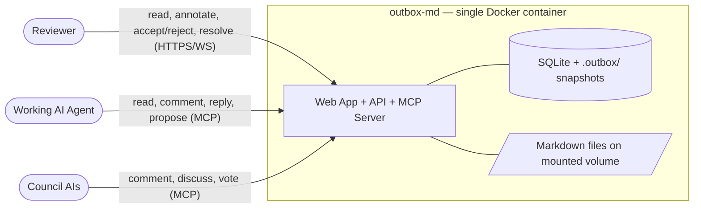
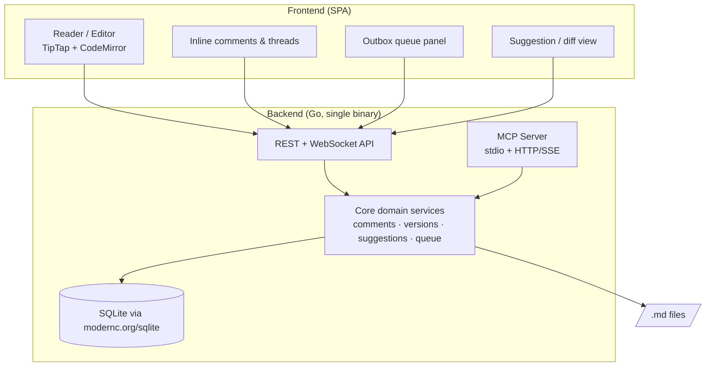
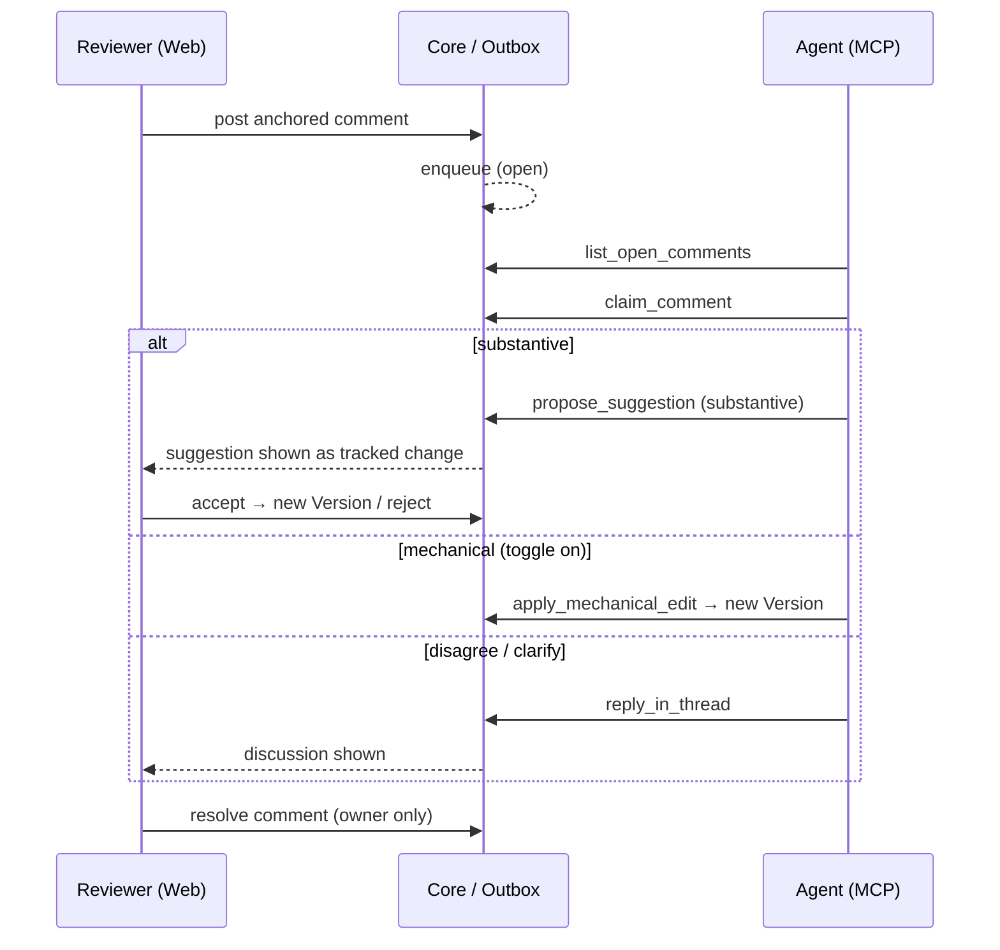
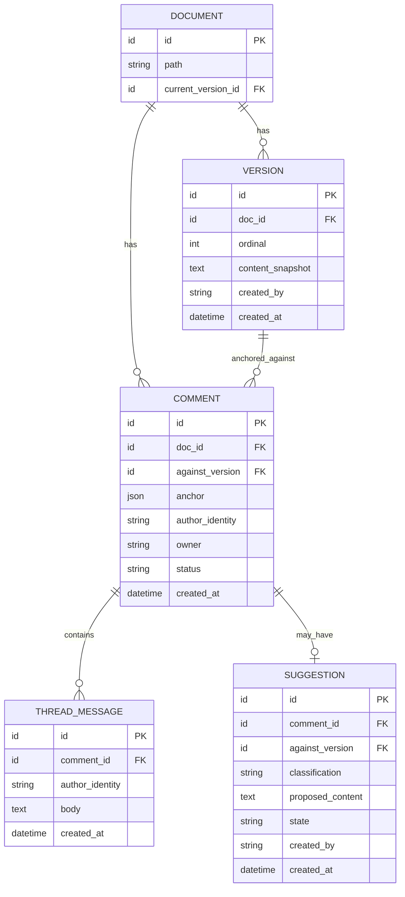

# outbox-md — Design Specification

| | |
|---|---|
| **Document** | Design Specification |
| **Project** | outbox-md |
| **Status** | Draft — pending approval |
| **Version** | 0.3 |
| **Date** | 2026-06-27 |
| **Type** | Greenfield · Open-source · Local-first |
| **Authors** | Project team |

---

## Table of contents

1. [Executive summary](#1-executive-summary)
2. [Problem statement](#2-problem-statement)
3. [Goals & non-goals](#3-goals--non-goals)
4. [Guiding principles](#4-guiding-principles)
5. [Domain model](#5-domain-model)
6. [System architecture](#6-system-architecture)
7. [Technology stack](#7-technology-stack)
8. [Data model](#8-data-model)
9. [MCP interface](#9-mcp-interface)
10. [Versioning & merge strategy](#10-versioning--merge-strategy)
11. [Key workflows](#11-key-workflows)
12. [Extensibility](#12-extensibility)
13. [Roadmap & deferred scope](#13-roadmap--deferred-scope)
14. [Risks & open questions](#14-risks--open-questions)

---

## 1. Executive summary

**outbox-md** is a local-first, Dockerized web application for **reading and inline-annotating AI-generated Markdown specifications**. A reviewer's comments are not applied to the document directly; they enter an ordered **outbox** and are processed **asynchronously** by any AI agent connected over the **Model Context Protocol (MCP)**. The agent either proposes a tracked-change suggestion or replies in a discussion thread. The document is therefore improved continuously while remaining **uncorruptible, ordered, and fully auditable**.

The application is deliberately **agent-agnostic**: it ships **no LLM credentials** and embeds no model. It is a *substrate* that exposes documents, comments, threads, suggestions, and version history over MCP, allowing Claude, GPT, Cursor, or any future agent to perform the reasoning.

## 2. Problem statement

AI agents (e.g. superpowers, Claude, GPT) routinely generate large Markdown specifications. The feedback loop on these artifacts is broken:

- Documents are read in a chat window or a generic editor with poor reading ergonomics.
- The only feedback channel is a disconnected chat message ("change section 3") — feedback is **detached from the text it refers to**.
- Applying feedback by re-prompting risks the agent **rewriting unrelated parts**, with no ordering guarantees and no audit trail.

There is currently **no purpose-built surface** for annotating an AI-generated document and iterating it safely into a finished specification.

## 3. Goals & non-goals

### Goals

- **G1** — A first-class reading and **inline-annotation** experience for Markdown.
- **G2** — Feedback is processed **asynchronously and in strict order**; the document is never mutated directly.
- **G3** — **Agent-agnostic** integration through MCP; no vendor lock-in, no embedded model.
- **G4** — Complete **auditability**: every version, comment, and decision is recorded.
- **G5** — **Zero-friction local deployment**: a single Docker container pointed at a folder.

### Non-goals (v1)

- **NG1** — Embedding an LLM or shipping provider credentials.
- **NG2** — Using git as the versioning engine, or interacting with the host project's git.
- **NG3** — Real-time multi-user collaborative editing (CRDT).
- **NG4** — Multi-tenancy or hosted SaaS.
- **NG5** — Orchestrated multi-model council voting (the data model supports it; orchestration is deferred — see §13).

## 4. Guiding principles

- **North star — Safe async iteration.** When requirements conflict, prefer the option that (a) cannot corrupt the document and (b) preserves ordering and auditability. Performance and feature breadth yield to this.
- **Substrate, not orchestrator.** The app stores and exposes state; agents do the thinking.
- **One primitive for all authors.** Humans, the working agent, and council AIs all act through the same comment/thread model.
- **Resolution stays with the owner.** Only the author of a comment may resolve it (§5).
- **Build the seams, defer the features.** Extension points (multi-author identity, MCP boundary, edit classification) ship in v1; the features behind them (council orchestration, built-in processor) come later.

## 5. Domain model

| Concept | Definition |
|---|---|
| **Document** | A Markdown file under management. The on-disk `.md` is the *current projection* only. |
| **Version** | An immutable, linearly-ordered snapshot of a document's full content. |
| **Comment** | Feedback anchored to a text range, owned by its author, living in a thread. |
| **Thread** | The discussion attached to a comment: replies from any author (human / working agent / council). |
| **Suggestion** | A proposed tracked-change edit attached to a comment, classified `mechanical` or `substantive`. |
| **Outbox** | The ordered queue of open comments awaiting agent processing. |
| **Author identity** | A first-class field on comments, replies, and suggestions: `human`, `agent`, or `council:<id>`. |

**Rules**

- **Edit classes.** `substantive` edits always arrive as **suggestions** (accept/reject). `mechanical` edits (spelling, grammar, formatting) may **auto-apply**, gated by a user toggle that is **off by default**. The agent self-classifies each edit.
- **Resolution authority.** Only the original comment **owner** may resolve a comment. An agent may mark a comment *addressed* and attach a suggestion, but cannot close it.
- **Council as participants.** AIs other than the working agent post comments and discuss/vote **in the same threads**. "Voting" is a visible, multi-party thread surfaced to the human for context — not a separate subsystem.

## 6. System architecture

### 6.1 System context

### 6.2 Component view

The backend is a **single Go binary** exposing two faces over the same core domain services: an **HTTP/WebSocket API** for the human UI, and an **MCP server** for agents. Neither face mutates documents except through the core services, which enforce ordering, classification, and resolution rules.

### 6.3 Processing loop

## 7. Technology stack

| Layer | Choice | Rationale |
|---|---|---|
| **Editor / annotation** | **TipTap (ProseMirror)** for the annotation surface; **CodeMirror 6** for raw/preview split | Strongest model for anchored comments + tracked-change suggestions (marks, decorations, plugins). |
| **Frontend** | React + Vite + TypeScript | Standard, fast; the annotation surface is inherently browser-side TS. |
| **Backend** | **Go** (stdlib `net/http` routing, or `chi`) + WebSocket (`coder/websocket`) | Single static binary, strong concurrency for the async outbox queue, tiny container, simple ops. |
| **MCP** | **`github.com/modelcontextprotocol/go-sdk`** (stdio + HTTP/SSE) | Official Go SDK; both transports for local and remote agents. Maturity to be confirmed during planning. |
| **Store** | **SQLite** via `modernc.org/sqlite` (pure Go, no CGO) | Embedded, zero-config; CGO-free build keeps the container minimal. |
| **Packaging** | Single **Docker** container (scratch/distroless) | Static Go binary + embedded SPA assets; one image, minimal surface. |

**Decision: Go backend + TypeScript frontend.** The annotation surface is a browser rich-text problem and is TypeScript regardless of backend, so the only open choice is the backend language. Go is selected for its single static-binary deployment, first-class concurrency (well-suited to the asynchronous outbox queue and long-running daemon), small container footprint, and operational simplicity. The Go MCP SDK is official and covers both transports; its relative newness versus the TypeScript SDK is the one item to validate during planning (see §14). A single Go binary serves the embedded SPA, the HTTP/WebSocket API, and the MCP server. (A TypeScript backend was considered for language unification but rejected: unification is unattainable anyway since the editor is TS, and Go is the stronger fit for a local daemon.)

## 8. Data model

- **Author identity** (`human | agent | council:<id>`) is first-class on `COMMENT`, `THREAD_MESSAGE`, and `SUGGESTION` — so council participation (v1.5) requires **no schema change**.
- `COMMENT.status`: `open → claimed → addressed/replied → resolved/closed`.
- `SUGGESTION.state`: `proposed → accepted | rejected | stale`.
- Document **content lives in the filesystem and in `VERSION.content_snapshot`**, never as the system of record inside relational columns beyond the snapshot.

## 9. MCP interface

The MCP server is the **sole** interface for agents. It exposes the following operations:

| Operation | Purpose |
|---|---|
| `read_doc` | Read current (or a specific) version of a document. |
| `list_open_comments` | Retrieve the ordered outbox of unprocessed comments. |
| `claim_comment` | Claim a comment for processing (prevents double-work). |
| `post_comment` | Author a new comment anchored to a text range. |
| `reply_in_thread` | Add a discussion message (counter, clarify, vote). |
| `propose_suggestion` | Attach a tracked-change edit, classified `mechanical \| substantive`. |
| `apply_mechanical_edit` | Apply a `mechanical` edit directly — **gated** by the user's auto-apply toggle. |

**Notably absent:** there is **no `resolve` operation for agents**. Resolution authority belongs to the comment owner (§5).

## 10. Versioning & merge strategy

The outbox **serializes** processing — suggestions are reviewed one at a time against the current version — so there is **no concurrent branching and no merge conflict to resolve**. Consequently:

- **No git engine.** The system never runs git against the host project and does not require the folder to be a git repository.
- **Linear, internal history.** Each accepted suggestion or auto-applied edit creates a new `VERSION` (full-text snapshot; Markdown files are small).
- **Diffs computed internally** for display via a standard text-diff library.
- **Apply = write + record.** Accepting a suggestion writes new content to the `.md` file and records a `VERSION`.
- **Staleness instead of conflicts.** A suggestion proposed against version *N* when *N+1* has landed is flagged `stale`; the agent re-proposes against current. A single ordinal comparison.
- **Isolation from host git.** All metadata lives under a sidecar `.outbox/` directory, auto-added to `.gitignore`. (Alternative: an external app-data store keyed by folder path. Default: `.outbox/` + gitignore.)

## 11. Key workflows

1. **Annotate** — Reviewer highlights text, posts a comment; it enters the outbox as `open`.
2. **Process** — A connected agent lists and claims the comment, then proposes a suggestion, applies a mechanical edit (if enabled), or replies in the thread.
3. **Review** — Reviewer sees a substantive suggestion as a tracked change and accepts (→ new version) or rejects.
4. **Discuss** — Council AIs and the working agent exchange thread messages; the reviewer reads them for context.
5. **Resolve** — The comment **owner** resolves the comment, closing the loop.

## 12. Extensibility

| Seam (built in v1) | Future capability it unlocks |
|---|---|
| Polymorphic **author identity** | Council members, multiple agents, bots — no schema change. |
| **MCP boundary** as the only agent interface | Add/swap agents by connecting another MCP client; council = more participants, not new architecture. |
| **Edit classification + per-class apply policy** | Richer auto-apply policies (per-author trust, per-section rules) extend the same gate. |
| **External processor** model | A built-in LLM processor (turnkey mode) implements the same MCP operations internally — drop-in. |
| **Internal `Version` interface** | An optional git-backed store (for standalone docs repos) can be added behind the same interface. |

## 13. Roadmap & deferred scope

| Phase | Scope |
|---|---|
| **v1** | Reader/editor, inline comments & threads, outbox queue, suggestions (accept/reject) + gated mechanical auto-apply, internal versioning, MCP server, single Docker container. Actors: human + one working agent. |
| **v1.5** | **Council** — multiple AIs connect via MCP and comment/discuss/vote in existing threads. No architectural change. |
| **Fast-follow** | **Built-in LLM processor** (turnkey mode) implementing the MCP operations internally for zero-agent first-run. |
| **Later** | Optional git-backed versioning mode; richer auto-apply policies; multi-tenancy/hosted (out of current scope). |

## 14. Risks & open questions

| # | Item | Notes |
|---|---|---|
| R1 | **Anchor stability** | Comment anchors must survive edits to the underlying text. Choice between character offsets vs. fuzzy text anchors; ProseMirror positions vs. re-anchoring on version change. *Prototype first — highest-risk item.* |
| R2 | **Comment-vs-version semantics** | Behaviour when the document changes beneath an open comment (re-anchor vs. mark against original version). |
| R3 | **MCP transport for remote agents** | How an external/remote agent reaches a locally-running container (stdio vs. HTTP/SSE; exposure model). |
| R5 | **Go MCP SDK maturity** | The official Go SDK is newer than the TypeScript one. Validate transport coverage, stability, and ergonomics during planning; the MCP boundary is isolated enough to swap if needed. |
| R4 | **Web delivery shape** | SPA + API vs. server-rendered within the single-container constraint. |
| Q1 | **`.outbox/` vs. external store** | Default `.outbox/` + gitignore; confirm whether an external app-data store is preferable for stricter host isolation. |

---

*Prepared for review. On approval, this specification proceeds to an implementation plan (writing-plans).*
